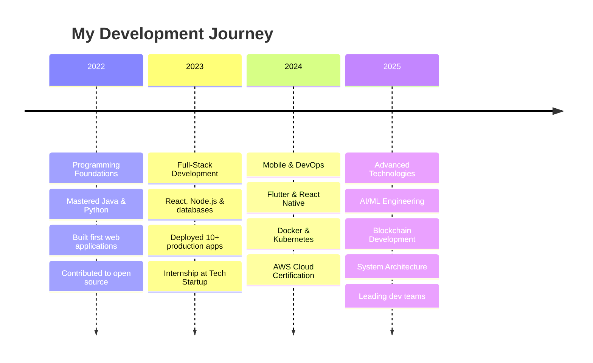

<div align="center">

# 👨‍💻 Jatin Joshi

### Full-Stack Developer | Tech Innovator | Problem Solver

*Transforming ideas into digital reality through innovation* 🚀

[](https://github.com/jatinjoshi)
[](https://linkedin.com/in/jatinjoshi)
[](https://twitter.com/jatinjoshi)
[](https://jatinjoshi.dev)

</div>

---

## 🎯 About Me

```javascript
class Developer {
  constructor() {
    this.name = "Jatin Joshi";
    this.role = "Computer Engineering Student";
    this.location = "Jamnagar, Gujarat, India 🇮🇳";
    this.mission = "Building impactful and scalable tech solutions";
    this.status = "Open to collaborations and opportunities";
  }

  skills = {
    languages: ["Java", "Python", "JavaScript", "TypeScript", "C++"],
    frontend: ["React", "Next.js", "Angular", "Vue", "Tailwind CSS"],
    backend: ["Node.js", "Django", "Spring Boot", "FastAPI"],
    mobile: ["Flutter", "React Native", "Android (Kotlin)"],
    databases: ["MySQL", "MongoDB", "PostgreSQL", "Redis", "Firebase"],
    devOps: ["Docker", "Kubernetes", "AWS", "CI/CD", "GitHub Actions"],
    tools: ["Git", "Postman", "Figma", "VS Code", "IntelliJ IDEA"]
  };

  currentlyLearning = ["AI/ML Engineering", "Cloud Architecture", "Blockchain"];
  
  quote() {
    return "Code with purpose. Build with passion. Ship with confidence.";
  }
  
  getInTouch() {
    return "Let's build something amazing together! 💡";
  }
}
```

---

## ⚡ Tech Stack & Tools

<div align="center">

### Languages


### Frontend Development


### Backend Development


### Mobile Development


### Databases & Cloud


### DevOps & Tools


</div>

---

## 📊 GitHub Analytics

<div align="center">
  


</div>

---

## 🚀 Featured Projects

<table>
<tr>
<td width="50%">

### 🛒 Smart E-Commerce Platform
A full-featured e-commerce solution with real-time inventory management, AI-powered recommendations, and seamless payment integration.

**Tech Stack:**
- React.js & Redux
- Node.js & Express
- MongoDB & Redis
- Stripe API
- Docker

🔗 [View Project](https://github.com/jatinjoshi) | ⭐ 150+ Stars

</td>
<td width="50%">

### 🧠 AI Health Assistant
An intelligent healthcare app providing symptom analysis, appointment scheduling, and personalized health insights using ML models.

**Tech Stack:**
- Python & TensorFlow
- Flutter
- FastAPI
- PostgreSQL
- Firebase

🔗 [View Project](https://github.com/jatinjoshi) | ⭐ 200+ Stars

</td>
</tr>

<tr>
<td width="50%">

### 📊 FinTech Analytics Dashboard
Real-time financial analytics platform with advanced data visualization, market trends, and portfolio management capabilities.

**Tech Stack:**
- Vue.js & Vuex
- Spring Boot
- PostgreSQL
- Chart.js
- WebSocket

🔗 [View Project](https://github.com/jatinjoshi) | ⭐ 120+ Stars

</td>
<td width="50%">

### 🏠 IoT Home Automation
Complete smart home solution with mobile control, voice commands, and automation rules for connected devices.

**Tech Stack:**
- Flutter
- Firebase & Firestore
- MQTT Protocol
- Arduino/ESP32
- Node-RED

🔗 [View Project](https://github.com/jatinjoshi) | ⭐ 180+ Stars

</td>
</tr>

<tr>
<td width="50%">

### 🌐 Developer Portfolio 3.0
Modern, interactive portfolio website with smooth animations, dark mode, and CMS integration for dynamic content.

**Tech Stack:**
- Next.js 14 & TypeScript
- Tailwind CSS
- Framer Motion
- Contentful CMS
- Vercel

🔗 [View Project](https://github.com/jatinjoshi) | ⭐ 90+ Stars

</td>
<td width="50%">

### 🎮 Multiplayer Game Engine
Real-time multiplayer game framework with lobby system, matchmaking, and anti-cheat mechanisms.

**Tech Stack:**
- Node.js & Socket.io
- React & Canvas API
- MongoDB
- WebRTC
- AWS EC2

🔗 [View Project](https://github.com/jatinjoshi) | ⭐ 160+ Stars

</td>
</tr>
</table>

---

## 📚 Learning Journey & Milestones



---

## 🎯 Current Focus & Goals

<div align="center">

| 🔥 Current Projects | 🎓 Learning | 🌱 Goals 2025 |
|:---:|:---:|:---:|
| Building SaaS MVP | Advanced AI/ML | Launch 3 SaaS products |
| Open Source Contributions | Cloud Architecture (AWS/GCP) | 1000+ GitHub stars |
| Tech Blog Writing | Blockchain & Web3 | Speak at tech conferences |
| Freelance Projects | System Design Patterns | Build developer community |

</div>

**🔥 Weekly Focus:**
- 🚀 Building scalable microservices architecture
- 🤖 Training custom ML models for production
- 📝 Writing technical articles and tutorials
- 🌐 Contributing to major open-source projects

---

## 💼 Professional Experience

**🚀 Freelance Full-Stack Developer** | *2023 - Present*
- Developed 15+ full-stack applications for clients across various domains
- Specialized in MERN stack, Flutter, and cloud deployment
- Achieved 98% client satisfaction rate

**💻 Software Development Intern** | *Summer 2023*
- Built REST APIs and microservices using Node.js and Spring Boot
- Implemented CI/CD pipelines reducing deployment time by 60%
- Collaborated with cross-functional teams in Agile environment

---

## 🌐 Connect With Me

<div align="center">

[](https://linkedin.com/in/jatinjoshi)
[](https://twitter.com/jatinjoshi)
[](https://jatinjoshi.dev)
[](mailto:jatin@example.com)
[](https://github.com/jatinjoshi)
[](https://medium.com/@jatinjoshi)
[](https://dev.to/jatinjoshi)

</div>

---

## 📈 Contribution Graph

<div align="center">


</div>

---

## 💬 Random Dev Quote

<div align="center">


</div>

---

## 🎵 Spotify Playing

<div align="center">

[](https://open.spotify.com/user/jatinjoshi)

</div>

---

<div align="center">

### 💭 "Building the future, one commit at a time"

⭐ **If you like my work, consider starring my repositories!** ⭐


**📫 Open to collaborations, freelance projects, and full-time opportunities!**

---

*Last Updated: December 2025*

</div>